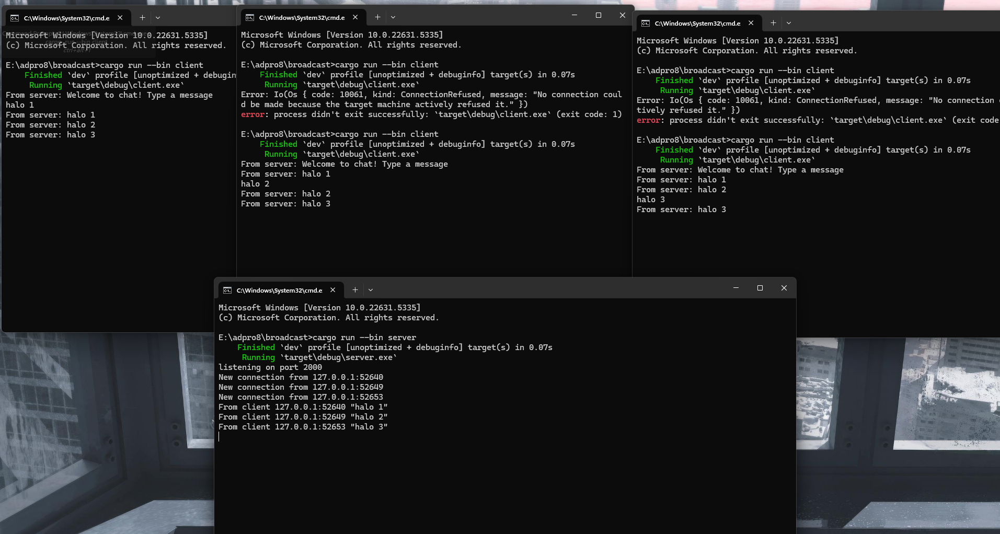
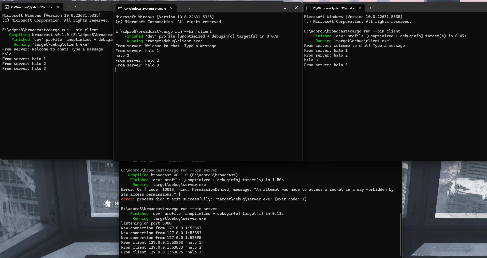

# Kevin Yehezkiel Manurung - 2206826974

### 2.1: Original code, and how it run

Client dan server saling berkomunikasi melalui WebSocket. Ketika seorang client mengirimkan pesan, server akan mendistribusikan pesan tersebut ke seluruh client yang sedang terhubung. Ini menciptakan efek broadcast, di mana setiap pesan yang dikirim oleh satu client akan diterima oleh semua client lainnya.

### Experiment 2.2: Modifying port

Agar sistem berfungsi dengan benar, kita harus memastikan bahwa port pada client.rs dan server.rs sama. Jika salah satunya menggunakan port yang berbeda, maka client tidak akan bisa terhubung ke server.