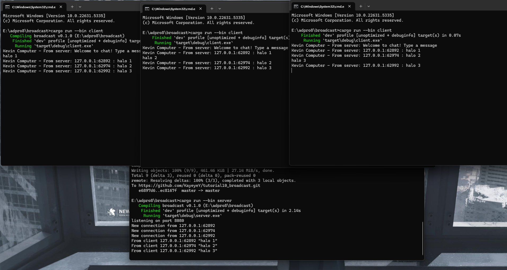

# Kevin Yehezkiel Manurung - 2206826974

### 2.1: Original code, and how it run

Client dan server saling berkomunikasi melalui WebSocket. Ketika seorang client mengirimkan pesan, server akan mendistribusikan pesan tersebut ke seluruh client yang sedang terhubung. Ini menciptakan efek broadcast, di mana setiap pesan yang dikirim oleh satu client akan diterima oleh semua client lainnya.

### 2.2: Modifying port

Agar sistem berfungsi dengan benar, kita harus memastikan bahwa port pada client.rs dan server.rs sama. Jika salah satunya menggunakan port yang berbeda, maka client tidak akan bisa terhubung ke server.

### Small changes. Add some information to client

Kita menyertakan informasi pengirim untuk setiap client, yaitu berupa IP dan Port. Dengan begitu, client dapat mengetahui asal pesan yang diterima. Untuk menerapkan perubahan ini, kita perlu menyesuaikan format bcast_tx.send di dalam server.rs.